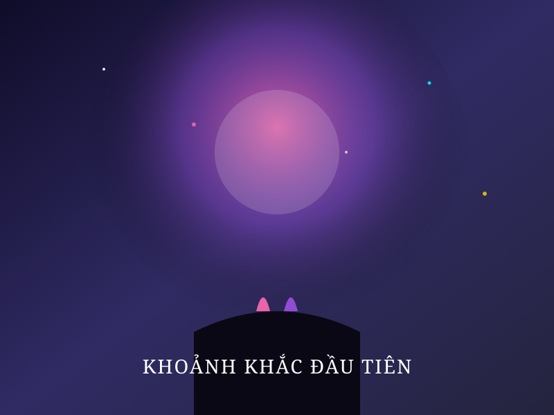

# 💖 Bức Tâm Thư — Romantic & Cinematic Web Experience



**Bức Tâm Thư** là một website phong cách điện ảnh (cinematic), lãng mạn và giàu cảm xúc. Website được thiết kế với chất lượng cao nhất, lấy cảm hứng từ ngôn ngữ thiết kế của **Apple**, **Spotify Wrapped**, **Awwwards**, và các tác phẩm điện ảnh như **Interstellar**, **Your Name**, **Violet Evergarden**.

Website hoạt động hoàn toàn **Client-side (Static Site)**, có thể đưa trực tiếp lên **GitHub Pages** và truy cập ngay mà không cần NodeJS, build tool, server hay database.

---

## 🌟 Tính Năng Nổi Bật

1. **Loading Screen Điện Ảnh**: Vòng xoay ngân hà orbital, trái tim nhịp đập glowing, thanh tiến trình % mượt mà.
2. **Cinematic Intro**: Các dòng chữ tâm sự hiển thị theo thứ tự với hiệu ứng mờ nhòe (blur), phát sáng (glow) và xuất hiện tinh tế.
3. **Vũ Trụ 3D Three.js**: Hàng nghìn ngôi sao lấp lánh, tinh vân huyền ảo, phản ứng tương tác theo chuyển động con trỏ chuột.
4. **Phong Bì 3D Tương Tác (Interactive Envelope)**: Phong bì 3D với con dấu sáp (wax seal), hiệu ứng lắc nhẹ khi di chuột, tự động mở nắp và đẩy lá thư lên toàn màn hình.
5. **Lá Thư Typewriter Sinh Động**: Hiệu ứng gõ chữ từng ký tự đồng bộ âm thanh gõ phím chân thực, hỗ trợ các nút Tạm dừng, Đọc lại, Đọc hết.
6. **Hiệu Ứng Trái Tim & Hoa Anh Đào Rơi**: 300 trái tim mây mờ cùng cánh hoa anh đào (Sakura) 3D rơi tự nhiên trên nền canvas.
7. **Sao Băng (Meteor Streaks)**: Các vệt sao băng rực rỡ lướt qua bầu trời đêm định kỳ từ 5 đến 10 giây.
8. **Album Kỷ Niệm 3D (Love Memory Gallery)**: Các thẻ hình ảnh kính mờ (Glassmorphism) hiệu ứng nghiêng 3D (card tilt parallax) kèm bộ xem ảnh Lightbox toàn màn hình.
9. **Dòng Thời Gian Tình Yêu (Love Journey Timeline)**: Trục thời gian phát sáng dọc thân trang, hiển thị các cột mốc ý nghĩa khi cuộn trang.
10. **Đồng Hồ Đếm Thời Gian Realtime**: Bộ đếm thời gian bên nhau tính chính xác từng Ngày, Giờ, Phút, Giây.
11. **Trích Dẫn Lãng Mạn (Quotes Generator)**: Bộ sưu tập những câu nói truyền cảm hứng tình yêu kèm chuyển cảnh hiệu ứng hạt.
12. **Pháo Hoa & Bão Trái Tim (Grand Finale)**: Màn trình diễn pháo hoa canvas rực rỡ kết hợp Confetti trái tim chúc mừng khi đọc xong lá thư.
13. **Âm Thanh Hybrids (Sound Engine)**: Tự động phát nhạc nền (`sounds/background.mp3`) và hiệu ứng âm thanh. Tích hợp bộ tổng hợp âm thanh **Web Audio API Synthesizer** dự phòng nếu file âm thanh bị thiếu hoặc bị trình duyệt chặn.
14. **Con Trỏ Phát Sáng (Custom Glowing Cursor)**: Con trỏ phát sáng với vệt hạt mịn và hiệu ứng sóng nước (ripple) khi nhấp chuột.

---

## 📂 Cấu Trúc Project

```
tam-thu/
│
├── index.html              # HTML5 Semantic Layout & CDN References
├── favicon.ico             # Favicon SVG Icon
├── README.md               # Hướng dẫn chi tiết project
│
├── css/
│   ├── style.css           # Token màu sắc, Glassmorphic & CSS Variables
│   ├── loading.css         # Màn hình chờ & Vòng xoay orbital
│   ├── intro.css           # Intro điện ảnh & Chữ mờ nhòe phát sáng
│   ├── galaxy.css          # Container Three.js & Tiêu đề dải ngân hà
│   ├── letter.css          # Phong bì 3D, Con dấu sáp & Giấy thư
│   ├── gallery.css         # Bộ sưu tập ảnh 3D & Lightbox Popup
│   ├── timeline.css        # Trục thời gian cuộn trang & Nút mốc kỷ niệm
│   ├── effects.css         # Con trỏ phát sáng, Đếm thời gian & Pháo hoa
│   └── responsive.css     # Tối ưu giao diện cho Mobile, Tablet & Desktop
│
├── js/
│   ├── app.js              # Khởi tạo & Điều phối toàn bộ ứng dụng
│   ├── audio.js            # Trình quản lý âm thanh (HTML5 + Web Audio Synth)
│   ├── cursor.js           # Con trỏ glowing & Hiệu ứng sóng nước
│   ├── galaxy.js           # Engine Three.js 3D Starfield & Nebula
│   ├── hearts.js           # Canvas particle trái tim lơ lửng
│   ├── sakura.js           # Canvas cánh hoa anh đào rơi 3D
│   ├── meteor.js           # Engine vệt sao băng lướt qua bầu trời
│   ├── fireworks.js        # Engine pháo hoa & Bão confetti trái tim
│   ├── loading.js          # Preloader % mượt mà
│   ├── intro.js            # Chuỗi GSAP reveal lời dẫn Intro
│   ├── typing.js           # Typewriter gõ chữ lá thư & Đồng bộ âm thanh
│   ├── countdown.js        # Bộ đếm ngày yêu nhau realtime
│   ├── gallery.js          # Hiệu ứng card tilt 3D & Lightbox modal
│   ├── timeline.js         # ScrollTrigger xuất hiện mốc kỷ niệm
│   ├── quotes.js           # Bộ tạo trích dẫn lãng mạn
│   └── scroll.js           # Cuộn mượt Lenis & GSAP ScrollTrigger
│
├── assets/
│   ├── images/             # Vector SVG Kỷ niệm nghệ thuật (memory1.svg, ...)
│   ├── videos/             # Thư mục chứa video (nếu có)
│   ├── icons/              # Icon hệ thống
│   └── fonts/              # Font chữ dự phòng
│
└── sounds/
    ├── background.mp3      # Nhạc nền lãng mạn chính
    ├── don-gian-anh-yeu-em.mp3 # Nhạc nền dự phòng
    ├── typing.mp3          # Âm thanh gõ phím
    ├── click.mp3           # Âm thanh nhấp chuột
    ├── open.mp3            # Âm thanh mở phong bì
    ├── fireworks.mp3       # Âm thanh pháo hoa
    └── ending.mp3          # Âm thanh màn kết thúc
```

---

## 🚀 Cách Chạy Trực Tiếp Ở Máy Local

Website **không cần NodeJS**, **không cần npm**, **không cần build**.

1. Tải source code hoặc clone repository về máy:
   ```bash
   git clone https://github.com/ngimnee/<repository-name>.git
   ```
2. Mở trực tiếp file `index.html` bằng bất kỳ trình duyệt nào (Chrome, Edge, Safari, Firefox) hoặc dùng extension **Live Server** trong VS Code.

---

## 🌐 Cách Deploy Lên GitHub Pages (Miễn Phí 100%)

Website sử dụng **100% đường dẫn tương đối** (`./css/style.css`, `./sounds/background.mp3`), đảm bảo hoạt động hoàn hảo ngay sau khi bật GitHub Pages:

1. Đăng nhập vào tài khoản [GitHub](https://github.com).
2. Tạo một Repository mới (ví dụ tên: `love-letter` hoặc `tam-thu`).
3. Push toàn bộ source code trong thư mục lên Repository:
   ```bash
   git init
   git add .
   git commit -m "Initial commit - Bức Tâm Thư"
   git branch -M main
   git remote add origin https://github.com/ngimnee/<repository-name>.git
   git push -u origin main
   ```
4. Trên GitHub, truy cập vào **Settings** của Repository -> Chọn **Pages** (ở cột bên trái).
5. Tại mục **Build and deployment**:
   - **Source**: Chọn `Deploy from a branch`.
   - **Branch**: Chọn `main` / Thư mục `/ (root)`.
   - Nhấn **Save**.
6. Sau 1 - 2 phút, website của bạn sẽ hoạt động tại đường dẫn:
   ```
   https://ngimnee.github.io/<repository-name>/
   ```

---

## ✏️ Hướng Dẫn Tùy Chỉnh Nội Dung

### 1. Thay Đổi Nội Dung Lá Thư & Chữ Ký
Mở file `js/typing.js`, bạn sẽ thấy biến `LETTER_CONTENT` và `SIGNATURE`:
```javascript
const LETTER_CONTENT = `Gửi em, người con gái đã làm thay đổi cả thế giới của anh...

[Nhập nội dung tâm sự của bạn ở đây]`;

const SIGNATURE = "Mãi yêu em,\nAnh của em ❤️";
```

### 2. Thay Đổi Ngày Bắt Đầu Yêu Nhau (Đồng Hồ Đếm)
Mở file `js/countdown.js`, thay đổi biến `START_DATE`:
```javascript
// Định dạng: YYYY-MM-DDTHH:mm:ss
const START_DATE = new Date('2023-02-14T00:00:00');
```

### 3. Thay Đổi Nhạc Nền & Âm Thanh
Đặt file MP3 của bạn vào thư mục `sounds/`:
- Nhạc nền: `sounds/background.mp3` (hoặc `sounds/don-gian-anh-yeu-em.mp3`)
- Tiếng gõ chữ: `sounds/typing.mp3`
- Tiếng mở thư: `sounds/open.mp3`

### 4. Thay Đổi Ảnh Kỷ Niệm Trong Album
Thay các file hình ảnh của bạn vào thư mục `assets/images/` và cập nhật lại đường dẫn trong `index.html`:
```html

```

---

## 🛠️ Công Nghệ Sử Dụng

- **HTML5 & CSS3**: Glassmorphism, 3D Transforms, CSS Gradients, Flexbox/Grid, Keyframe Animations.
- **JavaScript (ES6+)**: Modular IIFE Pattern, Web Audio API Synthesizer.
- **Three.js (r128)**: 3D Particle Starfield & Nebula Shader Scene.
- **GSAP & ScrollTrigger**: Smooth Animations & Scroll-based Reveals.
- **Lenis**: 60FPS Smooth Scrolling Engine.
- **Canvas Confetti**: Celebration Heart Burst Launcher.
- **Font Awesome 6 & Google Fonts**: Cinzel, Dancing Script, Playfair Display, Be Vietnam Pro.

---

## 📄 Giấy Phép (License)

Dự án được phát triển từ PY. Bạn có thể tùy chỉnh và sử dụng cho mục đích cá nhân.
